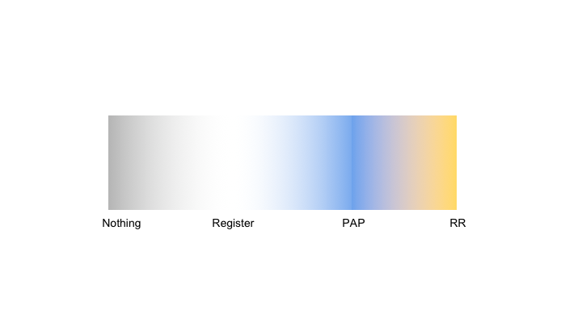

# Little experiment [10mins]

## Explanation to participants

### Read and complete the sheet: DO NOT LOOK AT OTHERS SHEETS

### Go to the website bellow and complete with your answers.

\begin{center}
\LARGE{https://goo.gl/aj8W61}  
\end{center}

## Explanation to researchers

### You just participated in (highly simplified) version of **The Ultimatum Game**

### The goal of the UG is to measure attitudes about fairness and/or expectations about (econ) rational behavior. 

### Our little experiment was trying to measure if the responses to the UG can be anchored by a completly irrelevant number:
The ID number at the beginning of your sheet!

## Explanation to researchers

### Treatment was receiving an ID number between 960 and 999.
### Control receive an ID number between 10 and 49.

### Outcome: Offer made in the UG

### For the hands-on excercise, you can use this experiment, or work with your own paper/project. 

# Registration & PAP: What

## What is a Registration and a PAP? (Clark 2017)  

### Registration: 
Title, country, status, keyword,
abstract, start and end dates, outcomes, intervention,
basic research design, whether treatment clustered, IRB
information.  

### PAP: 
Detailed description of research design and
data analysis plans, submitted to a registry BEFORE
looking at the data.
# Registration & PAP: Why

## Why Register? Publication Bias [10 min version]
### Effect sizes diminish with sample size (Gerber, Green, Nickerson 2001).

### There is a higher fraction of rejected hypothesis tests in social compared to hard sciences (Fanelli 2010).

### Published null results are disappearing over time, in all disciplines (Fanelli 2011).

### The file drawer problem is large. (Turner et al 2008, Franco et al. 2014)

## Publication Bias in FDA Aproved Drugs

 \centerline{\includegraphics[height=3in]{TurnerFigure1.png}}

## Publication Bias Across Social Science
 \centerline{\includegraphics[height=3in]{Tess.png}}

## Why Do We Need PAPs? Casey et al. 2012

## Why Do We Need PAPs? Athey 2018

## Why Do We Need PAPs? BuzzFeed 2018!

## Why Do We Need PAPs? The Social Planner View (Haushofer, 2017)

**Benefits:**  
1. Improves transparency: clear ex ante what the researcher planned  
2. Reduces false positives: fewer forking paths, less p-hacking  
3. Reduces the filedrawer problem; others can ask what happened to your project. 

\pause

**Costs:**    
1. Time cost. I don’t think this is very large, see below.  
2. Stifles exploratory work. I don’t think this is true, see below.  
3. Pre-specifying the wrong analyses (ex ante or ex post). This is potentially serious.   

**Reducing costs:**    
1. Time cost: make the PAP your methods section later.  
2. Exploratory work: datamine to your heart’s delight! Just be honest about it.  
3. Pre-specifying the wrong analyses: Be honest about your thought process and hope for sensible readers/referees.  

# Registration & PAP: How

## Difference between Registration and PAP?

  - Key difference is the amount of detail/effort. 
  - Registration: very easy, goal is to address publication bias. 
  - PAP: much more detail required. Similar to grant application/work plan.
 - It is more a matter of degree. 

## Similarities between Registration and PAP?

 - Time stamped document, public (or to be published in a specified date), that describes a prospective study. 
 - Both go in same registries:
    - Medicine: clinicaltrial.gov
    - Social Science (RCTs): socialscienceregistry.org
    - Social Science (Observational in dev. countries): [RIDIE (3ie)](http://www.3ieimpact.org/en/evaluation/ridie/)
    - All diciplines and methods: osf.io

## Hands-on Registration.
Based on a project of your own, or on our little experiment:  

 - Create a draft of using [Open Science Framework](osf.io) at [osf.io](osf.io):  
     - Open format
     - AsPredicted (will work with this one)
  
 - Explore [AEA Registry](www.socialscienceregistry.org) at [www.socialscienceregistry.org](www.socialscienceregistry.org)

## Registration of our Little Experiment 
Using Aspredicted format:    
\pause  
 - **Research question:** Does exposure to a large number increases the offer made in the ultimatum game?  
\pause  
 - **Dependent variable:** Amount offered in the ultimatum game.   
\pause  
 - **Treatment:**  Participant will be randomly assigned a large number ([960, 999]) or a small number ([10, 49]) to be read and remember, before reading the ultimatum game question.   
\pause    
 - **Analyses:** OLS regression of amount offer as dependant variable and treatment as regressor.     
\pause    
 - **Outliers and Exclusions:** Will exclude participants with missing information in any field. Amounts beyond plausible values (eg offers above max dollar value) will be will be top-coded.   
\pause  
 - **Sample size:** We will define our sample by the number of participants in the workshop.   

## How to do a PAP? Glennerster & Takavarasha Suggestions  

Report:  

 - The main outcome measures.  
 - Which outcome measures are primary and which are secondary.  
 - The precise composition of any families that will be used for mean effects analysis.  
 - The subgroups that will be analyzed.  
 - The direction of expected impact if we want to use a one-sided test.   
 - The primary specification to be used for the analysis.  

## How to do a PAP? McKenzie Suggestions
[World Bank Development Impact Blog](http://blogs.worldbank.org/impactevaluations/a-pre-analysis-plan-checklist)

 - Description of the sample to be used in the study  
 - Key data sources  
 - Hypotheses to be tested throughout the causal chain  
 - Specify how variables will be constructed  
 - Specify the treatment effect equation to be estimated  
 - What is the plan for how to deal with multiple outcomes and multiple
  hypothesis testing?  
 - Procedures to be used for addressing survey attrition  
 - How will the study deal with outcomes with limited variation?  
 - If you are going to be testing a model, include the model  
 - Remember to archive it  

## OSF registration format for Pre-reg Challenge  
 { width=50% }    
   
   
 
 
## Register Reports at the JDE.  

   
[Guidelines](https://www.elsevier.com/__data/promis_misc/JDE_RR_Author_Guidelines.pdf) and [Checklist](https://docs.google.com/spreadsheets/d/1zhG3AxOJIB7H1m4-S0jwMN1cQKNVsLomsxktEDVrbP8/edit#gid=1835444640)

<!--
## Summary ????
-->

## Final Considerations for Registrations & PAPs

### Time dimention. 
 - Both PAPs and Registrations should be submitted to a public registry *before* looking at the *entire dataset*.

 - A broadly defined registration should not change much so the earlier the better. 
 
 - A precise PAP need as much information as possible. Ok to look at data, as long as can prove lack of access either treatment or outcome variable.   
 
### Deviations. 
 - It is comletely fine to deviate from the original PAP. Just label it properly. 
 - Really good example of how to handle deviations: Green's SOPs ([Article](https://www.stat.berkeley.edu/~winston/sop-safety-net.pdf), [SOP](http://alexandercoppock.com/Green-Lab-SOP/Green_Lab_SOP.html))

 
# Reporting Guidelines [10mins]

## Why Do We Need Reporting Guidelines?  
Defines minimal set of elements required in a scientific paper. 
Helps with:  
 - Structured PAPs  
 - Replicability    
 - Meta-analysis    
 
 
## How to follow Reporting Guidelines  
 - CONSORT Guidelines & EQUATOR network.
 - Recent APA guidelines.
 - JDE suggested guidelines for register reports. 
 
## CONSORT Guidelines & EQUATOR network.

## CONSORT Guidelines & EQUATOR network.
  
EQUATOR Network: website containing more than 300 other guidelines.
